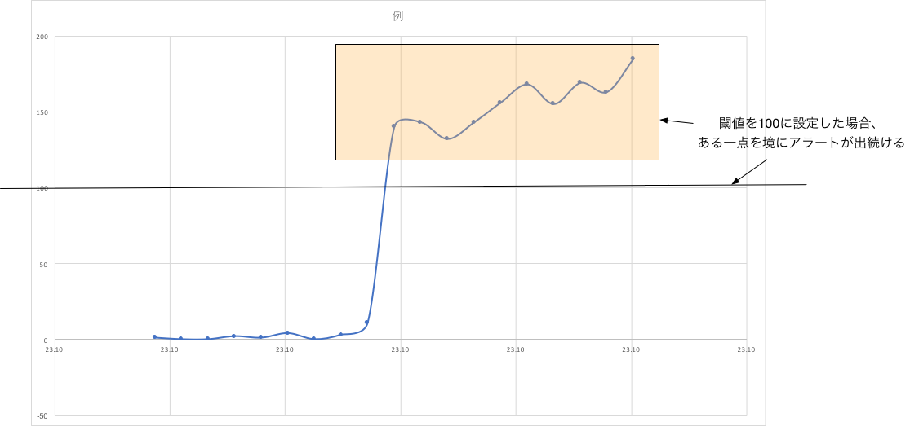
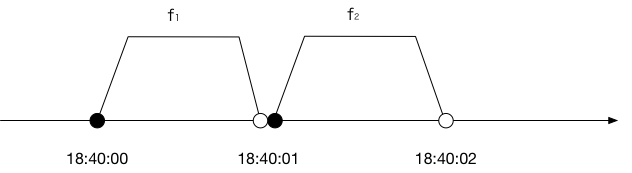
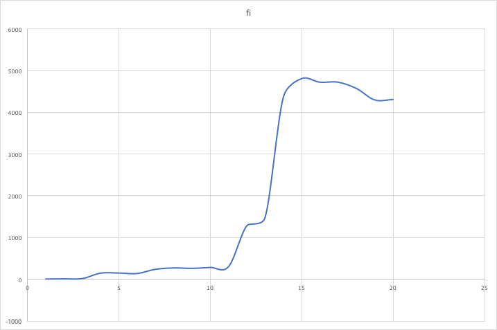

# Chapter 2. バースト検出

バースト検出： ウェブ上の活動の盛り上がり（**バースト**）を検出する。

例：
- 2011年3月の東日本大震災直後の「地震」のようなキーワードを含むツイート
- 「風の谷のナウシカ」放映時の「バルス」を含むツイート

### 単純に検出する方法

#### ある値を閾値として、それを超えたらアラートを出す

例：1秒間に10回以上、「バルス」を含むツイートが現れたらアラートを出す

普段の値が安定していて、スパイクしてすぐ戻るようであれば問題ない。

##### 課題

ある一点を境に、しばらく値が閾値を超え続けるような状況では、ずっとアラートが出続ける。

例えば、2011年3月10日までは秒10ツイート以上、「地震」というキーワードが含まれた時にアラートを上げる設定でよかったのが、翌日以降は定常状態が変化したためにそれでは過剰なアラートになるというような状況

履歴データから活動の一時的な盛り上がり「**バースト**」を検出する手法を考える。

応用先の例

- ソーシャルメディアの投稿
- サーバへのアクセス
- 購買数

例にあげたツイート数など、あらゆる活動の発生のことを**シグナル**の発生と総称する。

## 移動平均線収束拡散法

課題から、単なるシグナル量ではバースト検出するのは困難。

### 解決策

現在のシグナル発生量と過去の傾向を比較して、傾向を自動的に把握する。

### データの表し方

- 計測をスタートした時刻 <i>t0</i>
    - 例： 2017/7/26 18:40:00
- 時間間隔 <i>Δt</i>
    - 例：1秒
    - 単位は秒でも分でも日でも週でも月でも年でもいい
- 計測の回数 <i>T</i>回
    - 例：3回
    - <i>t0</i> = 2017/7/26 18:40:00、<i>Δt</i> = 1秒、 <i>T</i> = 3としたら
        - 2017/7/26 18:40:00〜2017/7/26 18:40:01
        - 2017/7/26 18:40:01〜2017/7/26 18:40:02
        - 2017/7/26 18:40:02〜2017/7/26 18:40:03
- 計測した時系列のデータ <i>F</i> = (<i>f</i>1, <i>f</i>2, ... <i>f</i>T)
    - 例： <i>F</i> = (5, 3, 4...)
    - 

<i>Δt</i>を1秒で置けば細かい時系列データ、1時間などにすると1日が24個のシグナル量で表現される。

#### 時系列データの例

|<i>i</i>|<i>fi</i>|<i>Δfi</i>|時刻|<i>i</i>|<i>fi</i>|<i>Δfi</i>|時刻|
|---|---|----|----|---|---|---|---|
|1|0|-|2013/4/23 23:10:16|11|297|20|2013/4/23 23:10:26|
|2|3|3|2013/4/23 23:10:17|12|1278|981|2013/4/23 23:10:27|
|3|11|8|2013/4/23 23:10:18|13|1477|199|2013/4/23 23:10:28|
|4|140|129|2013/4/23 23:10:19|14|4362|2885|2013/4/23 23:10:29|
|5|143|3|2013/4/23 23:10:20|15|4807|445|2013/4/23 23:10:30|
|6|132|-11|2013/4/23 23:10:21|16|4721|-86|2013/4/23 23:10:31|
|7|232|100|2013/4/23 23:10:22|17|4720|-1|2013/4/23 23:10:32|
|8|265|33|2013/4/23 23:10:23|18|4569|-151|2013/4/23 23:10:33|
|9|256|-9|2013/4/23 23:10:24|19|4295|-274|2013/4/23 23:10:34|
|10|277|21|2013/4/23 23:10:25|20|4305|10|2013/4/23 23:10:35| 

このデータからシグナル量急増を検出する単純なアイデア

時刻 <i>i</i> - 1 と 時刻 <i>i</i> のシグナル量の差分 <i>Δfi</i> に注目して、この値がある閾値を超えた時をバースト状態とみなす。

<i>Δfi</i> = <i>fi</i> - <i>f</i><i>i</i>-1

一見よさそう。たとえば、閾値500くらいにしておけば、<i>i</i> = 12 や <i>i</i> = 14は検出できそう。

##### 課題

- 時系列データ中の2点のみからデータ量の増減を把握しようとするため、観測値のばらつき（ノイズ）の影響を受けやすい。
    - 観測値のばらつきを軽減するには、より多くのデータ点を用いて、シグナル量の傾向を把握する必要性

##### 解決策

1. 時間解像度 <i>Δt</i>を長く（粗く）して、データを安定化させる
    - 検出間隔も間延びしてしまう
2. 時間解像度を変えずに、ある時刻の近くのシグナル量から平均値を算出して平滑化する
    - 時刻 i から過去に遡って n件のシグナル量の平均を計算する方法
        - **単純移動平均（SMA）**
    - 重みを付けて平均を計算する方法
        - **指数移動平均（EMA）**

